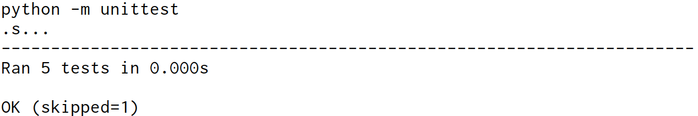
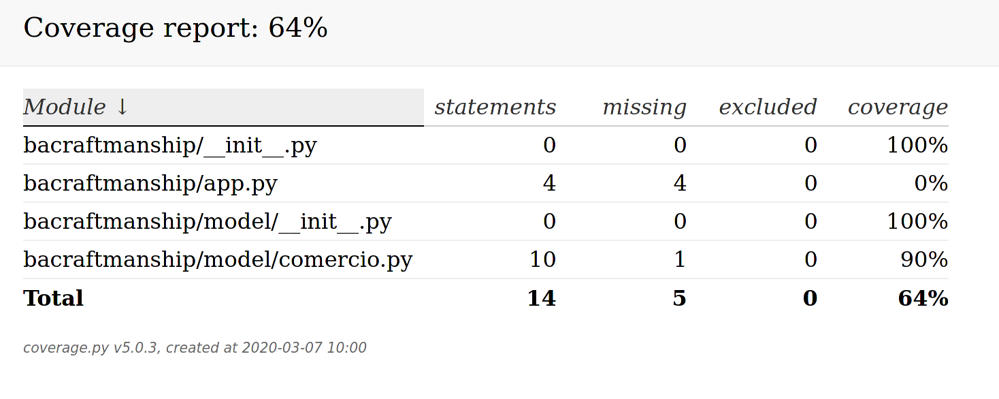

## Proyecto Python

Este proyecto se construyó utilizando las siguientes versiones de herramientas:

| Tecnología | Versión   |
| ---------- | -------   |
| python     | 3.6+      |
| coverage   | 5.0.3     |

(Probado en Python 3.6, 3.7 y 3.8)

### ¿Cómo importar el proyecto?

Para que esta tarea sea exitosa necesita importar el proyecto contenido en la
carpeta (`tecnologias/python/`) e instalar las dependencias:

```sh
python3 -m venv .venv
source .venv/bin/activate
pip install -r requirements.txt
```


### ¿Cómo correr los tests?

Podemos ejecutarlos con el comando `make test`.

```sh
$ make test
python3 -m unittest
.s...
----------------------------------------------------------------------
Ran 5 tests in 0.000s

OK (skipped=1)
```




### ¿Cómo visualizar la cobertura?

Para ello podemos ejecutar el comando `make coverage`, con el se abrirá una página web donde podremos ver el coverage.

Ejemplo:


